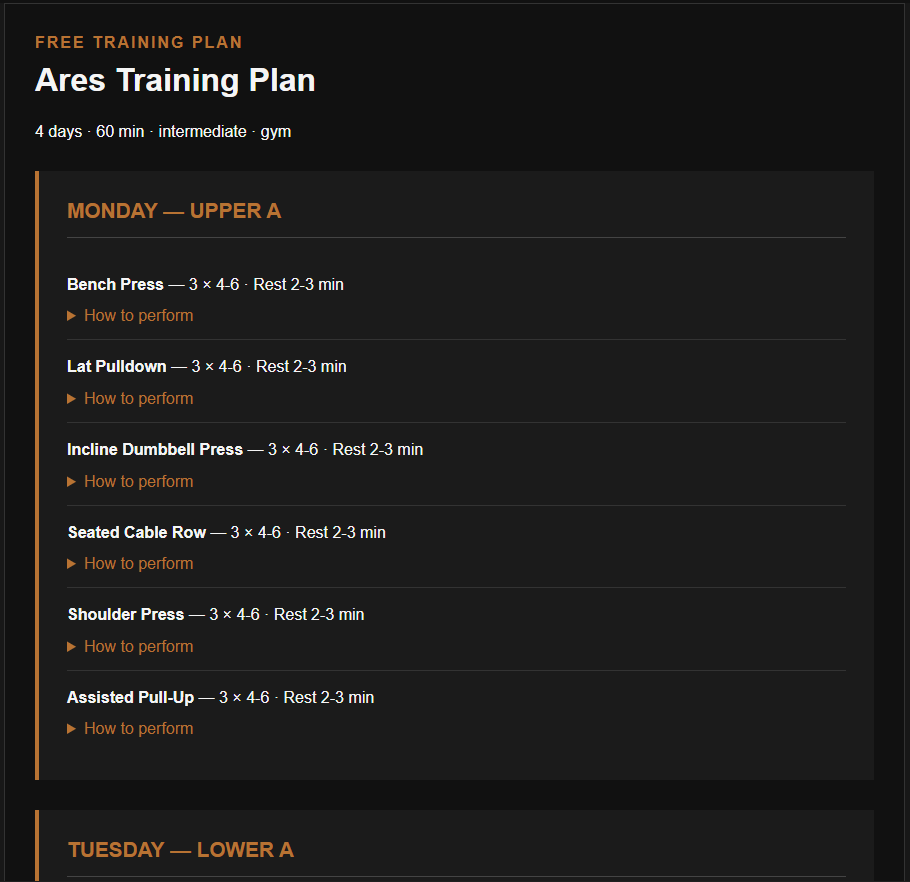
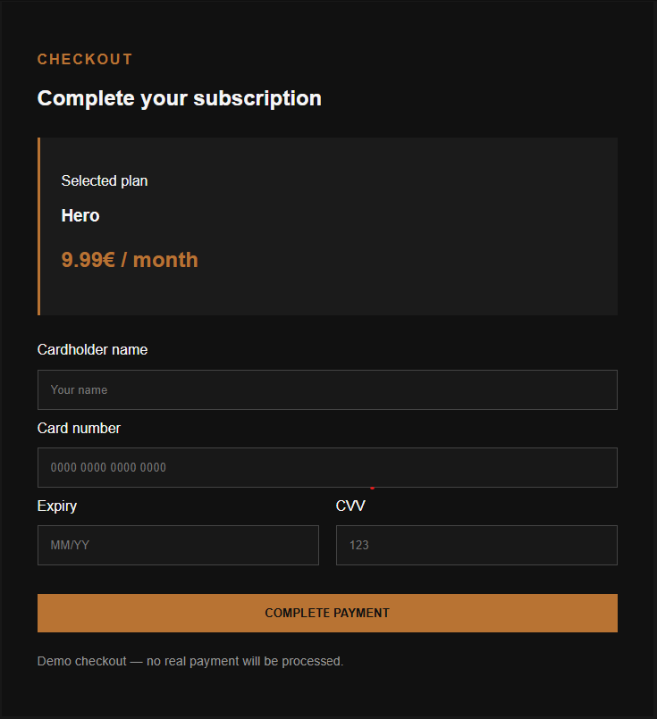

# OlimpoAthlete

OlimpoAthlete is a training planner I built while learning Angular and TypeScript during my Fachinformatiker für Anwendungsentwicklung (FIAE) Umschulung.

The idea behind the project is simple: instead of making the user decide every detail of their training, OlimpoAthlete asks for their goal, experience, available time and equipment, then builds the weekly structure for them.

This repository contains the first portfolio version of the project.

## Screenshots

### Landing Page


### Training Plan Generator



### Demo Checkout



## What it does

The user can:

- Create a demo account and log in
- Choose between three training coaches:
  - Ares — Strength
  - Hercules — Hypertrophy
  - Athena — Performance
- Enter training experience, available days, session duration and equipment
- Generate a weekly workout plan
- Get different exercises for gym, home or bodyweight training
- See sets, repetitions and rest times adapted to the selected coach
- Open a short explanation for each exercise
- Choose between free and premium plans
- Go through a simulated checkout

The interface is responsive and works on desktop and mobile.

## How the plan generator works

The current version does not use a real AI model yet.

It uses TypeScript rules to adapt the plan to the user's choices.

For example, the number of training days changes the weekly split, session duration changes the number of exercises, experience affects the number of sets, and each coach uses different repetition and rest ranges.

The exercise selection also changes depending on whether the user trains in a gym, at home or with bodyweight only.

## Built with

- Angular
- TypeScript
- HTML
- CSS
- Angular Forms
- Local Storage
- Git and GitHub

While building the project I worked with Angular component communication, `@Input()`, `@Output()`, `EventEmitter`, `[(ngModel)]`, `@if`, `@for`, forms and responsive layouts.

## Current user flow

```text
Landing Page
    ↓
Register / Login
    ↓
Choose Coach
    ↓
Complete Profile
    ↓
Generate Training Plan
```

Premium plans also include a demo checkout flow.

## Demo limitations

This is currently a frontend prototype, so some features are intentionally simplified.

Authentication is simulated with `localStorage`, there is no backend or database yet, passwords are not stored securely, the checkout does not process real payments and the training generator is rule-based rather than connected to an AI model.

These parts would need to be replaced with backend services before using the application as a real product.

## Run locally

Clone the repository:

```bash
git clone https://github.com/Zacariasaibel/OlimpoAthlete.git
```

Enter the project:

```bash
cd OlimpoAthlete/olimpo-athlete
```

Install the dependencies:

```bash
npm install
```

Start Angular:

```bash
ng serve
```

Then open:

```text
http://localhost:4200
```

## Next steps

The long-term idea is to turn OlimpoAthlete into more than a workout generator.

Future versions could include a backend and database, secure user accounts, workout history, progress tracking, exercise videos and real AI coaching based on the user's previous training data.

The goal is that OlimpoAthlete should not only tell you how to train — it should learn how you train.

## Status

**OlimpoAthlete V1 — frontend portfolio project**